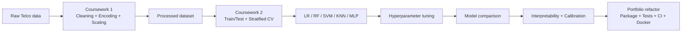
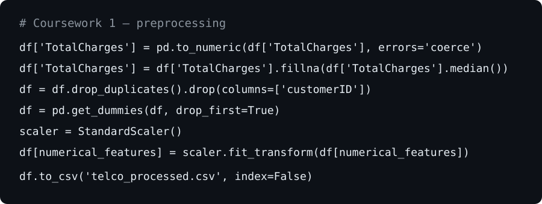

# AI Implementation & Machine Learning Engineering Portfolio

<p align="center">
  <a href="coursework/coursework-1/README.md"></a>
  <a href="coursework/coursework-2/README.md"></a>
  <a href="labs/README.md"></a>
  <a href="docs/RESULTS.md"></a>
  <a href="docs/ARCHITECTURE.md"></a>
  <a href="MODEL_CARD.md"></a>
</p>

<p align="center">
  
  
  
  
  <a href="https://github.com/ibrahimm2106/AI-Implementation/actions/workflows/ci.yml"></a>
  <a href="https://github.com/ibrahimm2106/AI-Implementation/actions/workflows/portfolio-checks.yml"></a>
</p>

A portfolio-quality presentation of my **BEng Software Engineering — AI Implementation and Impact in Software Engineering** work. It combines the original coursework/lab evidence with a later engineering refactor that adds **modular Python, leakage-aware pipelines, tests, CI, Docker, command-line workflows, reproducible experiments, documentation and responsible-AI notes**.

The flagship case study is **Telco Customer Churn Prediction**, progressing from data preparation in Coursework 1 to supervised model comparison, tuning, evaluation and interpretation in Coursework 2.

> **Academic transparency:** original student work is clearly separated from later portfolio improvements. This repository is an educational/portfolio record and should not be copied or submitted as coursework by other students.

## Portfolio overview


## 60-second recruiter tour

| What to inspect | Why it matters |
|---|---|
| [`src/ai_portfolio/`](src/ai_portfolio/) | Reusable Python package with separated data, model, evaluation and interpretability concerns |
| [`scripts/run_experiment.py`](scripts/run_experiment.py) | Reproducible training/tuning/evaluation orchestration |
| [`tests/`](tests/) | Automated tests for preprocessing, metrics, interpretation and portfolio evidence |
| [Coursework 1](coursework/coursework-1/README.md) | Data preparation, exploration and preprocessing decisions |
| [Coursework 2](coursework/coursework-2/README.md) | Five tuned models, CV, ROC/AUC, confusion matrices, calibration and interpretation |
| [Lab portfolio](labs/README.md) | Preprocessing, clustering, decision trees and TensorFlow/Keras neural networks |
| [`docs/RESULTS.md`](docs/RESULTS.md) | Final outputs and metrics in one place |
| [`MODEL_CARD.md`](MODEL_CARD.md) | Intended use, limitations, privacy/fairness considerations and deployment caveats |

## Skills demonstrated

- **Python software engineering** — modular package design, CLI scripts, reusable functions and tests.
- **Data engineering** — schema checks, missing-value handling, numeric conversion, encoding and scaling.
- **Supervised learning** — Logistic Regression, Random Forest, SVM, KNN and MLP.
- **Unsupervised learning** — Euclidean distance, K-means concepts and Ward hierarchical clustering.
- **Deep learning** — TensorFlow/Keras MNIST classification with dense layers, ReLU and softmax.
- **Model selection** — stratified cross-validation, hyperparameter search and baseline comparison.
- **Evaluation** — accuracy, precision, recall, F1, ROC-AUC, confusion matrices, threshold analysis and calibration.
- **Interpretability** — Random Forest feature importance and Logistic Regression coefficients.
- **Engineering quality** — GitHub Actions, Docker, Makefile, modularity, documentation and reproducibility.
- **Responsible AI** — limitations, human oversight, privacy, fairness and drift considerations.

## Flagship project — Telco Customer Churn

The original dataset contains **7,043 customer records and 21 columns**.



### Original Coursework 2 result

Random Forest produced the strongest tuned cross-validation F1 in the submitted experiment:

| Metric | Result |
|---|---:|
| CV F1 | **0.6344** |
| CV ROC-AUC | **0.8451** |
| Final test accuracy | **0.7884** |
| Final test precision | **0.6418** |
| Final test recall | **0.4599** |
| Final test F1 | **0.5358** |
| Final test ROC-AUC | **0.8226** |
| Brier score | **0.1454** |

## Coursework 1 — data preparation

[Open Coursework 1 →](coursework/coursework-1/README.md)

The original work inspects the data, converts `TotalCharges`, handles missing values, removes the identifier, encodes categorical variables, standardises numeric features and exports data for modelling.




## Coursework 2 — model development and evaluation

[Open Coursework 2 →](coursework/coursework-2/README.md)

The submitted experiment compares **Logistic Regression, Random Forest, SVM, KNN and MLP**, plus a dummy baseline. It also covers ROC-AUC, confusion matrices, feature importance, coefficients, threshold analysis, calibration and Brier score.


| Model comparison | Best-model confusion matrix |
|---|---|
|  |  |


## Practical lab portfolio

[Explore all labs →](labs/README.md)

| Lab | Topic | Main evidence |
|---|---|---|
| **Lab 02** | Data preprocessing | missingness, imputation, scaling, encoding, export |
| **Lab 07** | Clustering | Euclidean distance, Ward linkage and dendrogram |
| **Lab 08** | Decision Trees | categorical encoding, classification and tree rules |
| **Lab 10** | Neural Networks | TensorFlow/Keras MNIST training, prediction and evaluation |

### Lab 07 — hierarchical clustering


### Lab 10 — MNIST neural network

The original run reached **96.95% test accuracy**, predicted the first test image as **7**, and matched the true label **7**.

| Training history | Example prediction |
|---|---|
|  |  |

## Repository structure

```text
.
├── src/ai_portfolio/          # Reusable ML package
├── scripts/                   # Training and batch-prediction CLIs
├── tests/                     # Automated tests
├── coursework/                # Coursework 1 + Coursework 2 evidence
├── labs/                      # Practical labs + cleaned scripts
├── docs/                      # Results, architecture, recruiter guide, source mapping
├── .github/workflows/         # CI + portfolio checks
├── MODEL_CARD.md
├── Dockerfile
├── Makefile
└── pyproject.toml
```

## Run the engineering version

```bash
git clone https://github.com/ibrahimm2106/AI-Implementation.git
cd AI-Implementation
python -m venv .venv
# Windows: .venv\Scripts\activate
# macOS/Linux: source .venv/bin/activate
pip install -e ".[dev]"
pytest -q
```

Run the churn experiment with your authorised copy of the dataset:

```bash
python scripts/run_experiment.py --data data/WA_Fn-UseC_-Telco-Customer-Churn.csv --output-dir artifacts --quick
```

## Responsible AI

Customer-churn predictions can influence retention treatment. A real deployment would require privacy controls, subgroup performance analysis, threshold/cost optimisation, human review, drift monitoring and clear explanations. Predictive feature importance should not be interpreted as causal evidence.

## Documentation

- [Recruiter guide](docs/RECRUITER_GUIDE.md)
- [Results](docs/RESULTS.md)
- [Architecture](docs/ARCHITECTURE.md)
- [Assessment mapping](docs/ASSESSMENT_MAPPING.md)
- [Coursework origins](docs/COURSEWORK_ORIGINS.md)
- [Source inventory](docs/SOURCE_INVENTORY.md)
- [Model card](MODEL_CARD.md)

## Author

**Mohamed Ibrahim**  
BEng Software Engineering — University of Roehampton  
GitHub: [@ibrahimm2106](https://github.com/ibrahimm2106)
