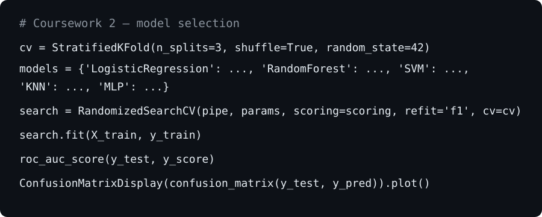
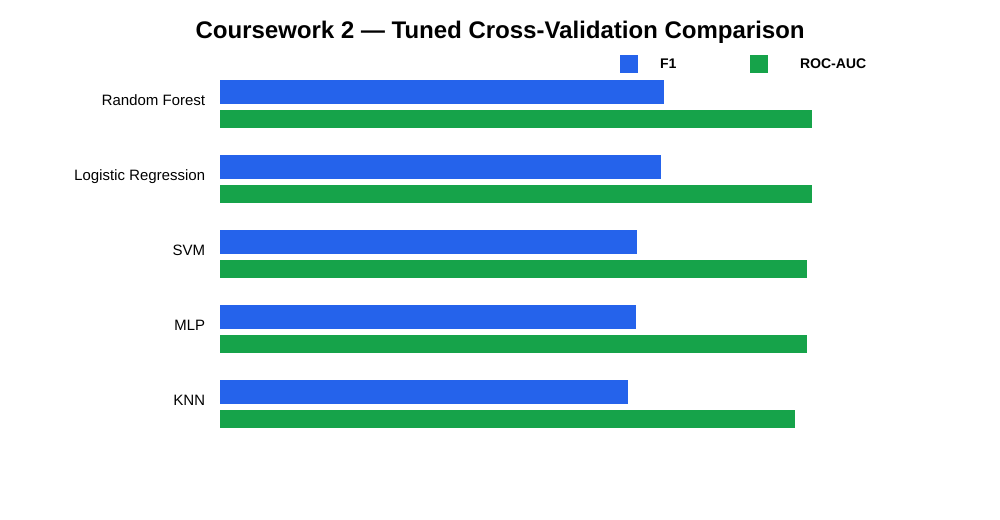
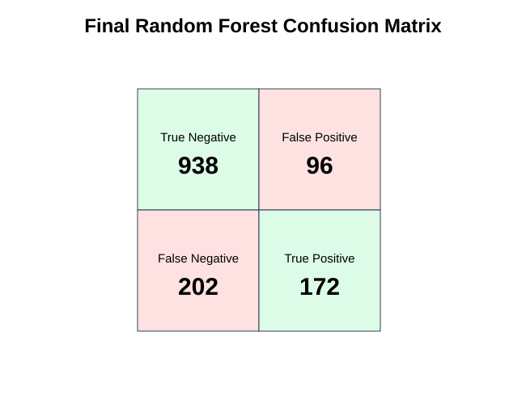
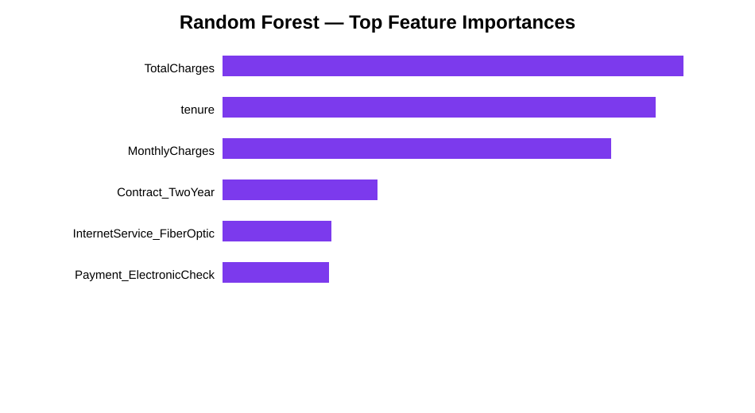

# Coursework 2 — Telco Churn Machine Learning Models

[](original/Coursework_2_Final.ipynb)
[](report/Coursework_2_Report.md)
[](outputs/)

Coursework 2 continues the Telco churn project with supervised machine learning. The original submission compares multiple model families, tunes hyperparameters with stratified cross-validation, evaluates the hold-out test set and produces visual/model-interpretation outputs.

## Models evaluated

- Logistic Regression
- Random Forest
- Support Vector Machine (SVM)
- K-Nearest Neighbours (KNN)
- Multi-Layer Perceptron (MLP)
- Dummy majority-class baseline

## Validation and evaluation

The original notebook uses a stratified train/test split and **3-fold `StratifiedKFold`** during tuning. F1 is the main tuning score because the churn class is the minority, while accuracy, precision, recall and ROC-AUC are retained for comparison.

### Tuned cross-validation summary

| Model | CV Accuracy | CV Precision | CV Recall | CV F1 | CV ROC-AUC |
|---|---:|---:|---:|---:|---:|
| Random Forest | 0.7720 | 0.5519 | 0.7461 | **0.6344** | **0.8451** |
| Logistic Regression | 0.7488 | 0.5170 | 0.8045 | 0.6294 | 0.8450 |
| SVM | 0.7008 | 0.4643 | **0.8324** | 0.5960 | 0.8392 |
| MLP | **0.8026** | **0.6527** | 0.5469 | 0.5946 | 0.8390 |
| KNN | 0.7846 | 0.5992 | 0.5667 | 0.5824 | 0.8217 |

### Final selected model

Random Forest was selected by CV F1. The original final test artifact reports:

| Metric | Result |
|---|---:|
| Accuracy | **0.7884** |
| Precision | **0.6418** |
| Recall | **0.4599** |
| F1 | **0.5358** |
| ROC-AUC | **0.8226** |
| Brier score | **0.1454** |

## Original code snapshot



## Model comparison



## Final Random Forest confusion matrix



## Random Forest feature importance



## Result files preserved

The `outputs/` directory keeps the machine-readable evidence used for the portfolio:

- `model_evaluation_results.csv` — hold-out comparison across candidate models.
- `tuned_model_results_fast.csv` — tuned stratified-CV results.
- `final_results_summary.csv` — combined selected-model summary.
- `final_test_metrics_best_model.csv` — final Random Forest test metrics.
- `rf_feature_importance.csv` — original tree importance values.
- `lr_coefficients.csv` — original Logistic Regression coefficients.
- `brier_score_best_model.csv` — calibration error summary.

The README renders lightweight SVG versions of the most useful original visual outputs so the repository stays fast to browse.

## Files preserved

```text
coursework-2/
├── original/
│   ├── Coursework_2_Final.ipynb
│   └── Coursework_2_Final.py
├── report/
│   └── Coursework_2_Report.md
└── outputs/
    ├── model_evaluation_results.csv
    ├── tuned_model_results_fast.csv
    ├── final_results_summary.csv
    ├── final_test_metrics_best_model.csv
    ├── rf_feature_importance.csv
    ├── lr_coefficients.csv
    └── brier_score_best_model.csv
```

## From coursework to engineering portfolio

The submitted notebook is intentionally retained as evidence. The reusable implementation under [`../../src/ai_portfolio/`](../../src/ai_portfolio/) separates data loading, preprocessing, model definitions, evaluation and interpretation into modules that can be tested and reused from the command line.

## Academic note

This directory preserves original coursework evidence for portfolio provenance. It is not provided as a template for other students to submit.
