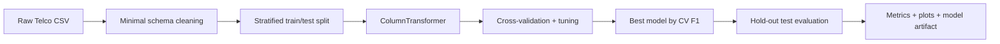

# Architecture

## Design goals

The portfolio refactor separates concerns that were originally combined inside notebooks:

1. **Data contract** — `src/ai_portfolio/data.py`
2. **Model definitions and search spaces** — `src/ai_portfolio/models.py`
3. **Evaluation and visual outputs** — `src/ai_portfolio/evaluation.py`
4. **Experiment orchestration** — `scripts/run_experiment.py`

## Training flow

## Leakage prevention

The most important engineering improvement is that imputation, scaling and one-hot encoding live inside each scikit-learn `Pipeline`. During cross-validation, each fold learns preprocessing parameters only from its training partition.

## Model selection

The search refits each candidate on F1 because churn is imbalanced and a plain accuracy score can hide poor positive-class performance. ROC-AUC, precision, recall and accuracy are still recorded for comparison.

The hold-out test set is not used to choose the winner. The winning model is selected using cross-validation F1, then evaluated once on the test set.

## Reproducibility

Where supported, estimators and splitting operations use `random_state=42`. Generated metrics, figures and the final fitted model are written to a user-selected output directory that is ignored by Git.
