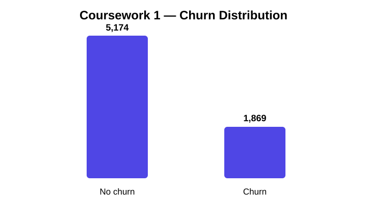

# Results and Final Outputs

This page collects the most useful evidence from the original coursework and labs in one place.

## Coursework 1 — data preparation outputs

The original Telco Customer Churn dataset contains **7,043 rows and 21 columns**. The preprocessing notebook converts `TotalCharges` to numeric, fills missing values with the median, removes duplicates, drops `customerID`, encodes categoricals, standardises the main numeric features and exports processed data/statistics.

### Churn distribution



## Coursework 2 — tuned model comparison

The processed dataset used by Coursework 2 contains **7,038 usable rows and 31 model features** after its loading/conversion step. The class split recorded by the notebook is:

- No churn: **5,171 (73.47%)**
- Churn: **1,867 (26.53%)**

### Cross-validation results

| Model | CV Accuracy | CV Precision | CV Recall | CV F1 | CV ROC-AUC |
|---|---:|---:|---:|---:|---:|
| Random Forest | 0.7720 | 0.5519 | 0.7461 | **0.6344** | **0.8451** |
| Logistic Regression | 0.7488 | 0.5170 | 0.8045 | 0.6294 | 0.8450 |
| SVM | 0.7008 | 0.4643 | **0.8324** | 0.5960 | 0.8392 |
| MLP | **0.8026** | **0.6527** | 0.5469 | 0.5946 | 0.8390 |
| KNN | 0.7846 | 0.5992 | 0.5667 | 0.5824 | 0.8217 |

### Hold-out comparison from the original evaluation CSV

| Model | Accuracy | Precision | Recall | F1 | AUC |
|---|---:|---:|---:|---:|---:|
| Logistic Regression | **0.8040** | **0.6601** | **0.5401** | **0.5941** | **0.8424** |
| SVM | 0.7940 | 0.6522 | 0.4813 | 0.5538 | 0.7894 |
| KNN | 0.7614 | 0.5525 | 0.5348 | 0.5435 | 0.7753 |
| Random Forest | 0.7848 | 0.6254 | 0.4733 | 0.5388 | 0.8179 |
| MLP | 0.7628 | 0.5581 | 0.5134 | 0.5348 | 0.7881 |
| Dummy | 0.7344 | 0.0000 | 0.0000 | 0.0000 | 0.5000 |

The tuned-model selection stage chose **Random Forest** by CV F1. The final refit/test artifact reports:

| Metric | Final Random Forest result |
|---|---:|
| Accuracy | **0.7884** |
| Precision | **0.6418** |
| Recall | **0.4599** |
| F1 | **0.5358** |
| ROC-AUC | **0.8226** |
| Brier score | **0.1454** |

The two tables intentionally show different stages of the original experiment rather than flattening them into one claim.

### Model comparison chart


### Final confusion matrix


### Random Forest feature importance


## Lab 02 — preprocessing result

The original notebook records missing values in multiple housing columns before preprocessing and **zero missing values after imputation**.

## Lab 07 — clustering result


The practical uses the ten 2D points from the exercise and visualises hierarchical clustering using **Euclidean distance + Ward linkage**.

## Lab 08 — decision-tree result

The original notebook output reports:

```text
Sample 1 Prediction: Hired
Sample 2 Prediction: Not Hired
```

It also exports readable tree logic using scikit-learn's `export_text`.

## Lab 10 — neural-network result

The original TensorFlow/Keras run trained a 64-unit hidden-layer network for 10 epochs on MNIST and reported:

```text
Test Accuracy: 0.9695
Test Loss: 0.1034
Predicted Digit: 7
True Label: 7
```


