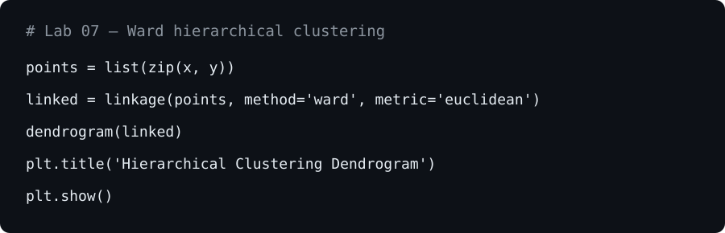
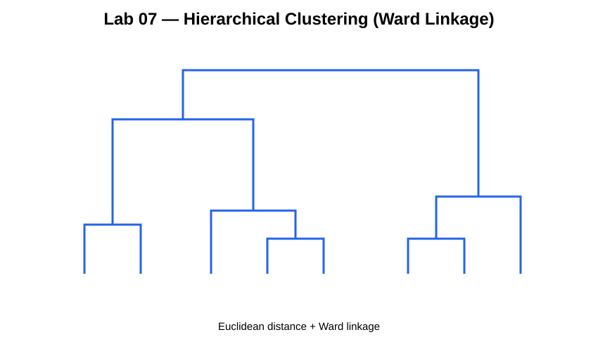
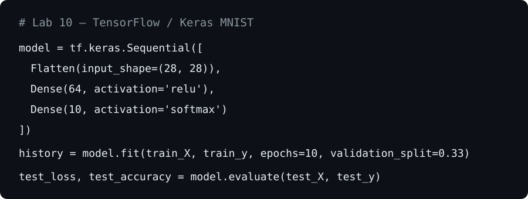
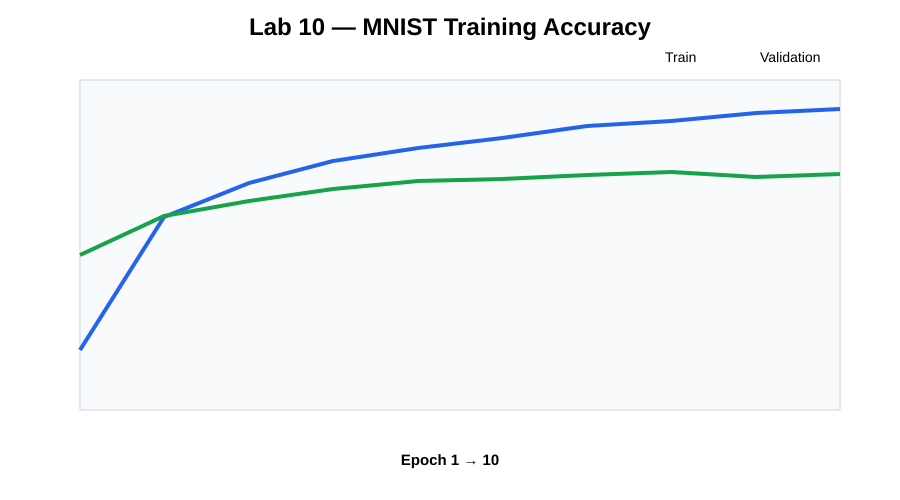
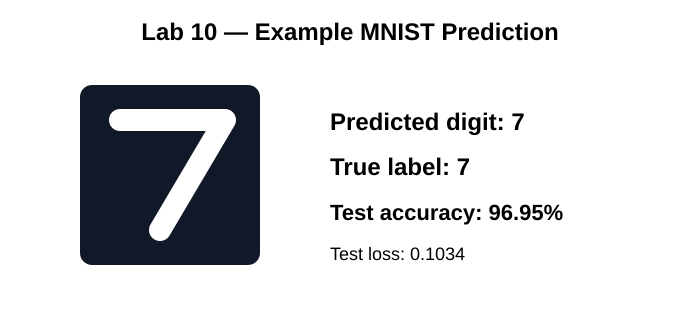

# AI / Machine Learning Practical Labs

[](original/lab02/)
[](original/lab07/)
[](original/lab08/)
[](original/lab10/)

This section keeps GitHub-friendly notebook/source editions based on the uploaded practical work and provides cleaned standalone Python versions for portfolio review.

## Lab 02 — Data preprocessing

**Concepts:** previewing data, checking missingness, median/constant imputation, numerical scaling, categorical encoding and CSV export.

The uploaded notebook records the missing-value counts, removes missingness through imputation, scales the numerical features and exports a processed dataset. The public repository keeps the preprocessing logic and documented final output while avoiding a duplicate large processed dataset file.

Files:

- [`original/lab02/Lab_2_Preprocessing.ipynb`](original/lab02/Lab_2_Preprocessing.ipynb)
- [`original/lab02/Lab_2_Preprocessing.py`](original/lab02/Lab_2_Preprocessing.py)
- [`lab02_preprocessing.py`](lab02_preprocessing.py)

## Lab 07 — Clustering and hierarchical clustering

**Concepts:** Euclidean distance, K-means concepts, Ward linkage and dendrogram visualisation.

### Code



### Ward-linkage dendrogram



Files:

- [`original/lab07/Lab_7_Clustering.ipynb`](original/lab07/Lab_7_Clustering.ipynb)
- [`original/lab07/Lab_7_Clustering.py`](original/lab07/Lab_7_Clustering.py)
- [`lab07_clustering.py`](lab07_clustering.py)

## Lab 08 — Decision Tree classification

**Concepts:** categorical encoding, `DecisionTreeClassifier`, sample predictions and interpretable tree rules.

The recorded uploaded-notebook output produced:

```text
Sample 1 Prediction: Hired
Sample 2 Prediction: Not Hired
```

It also printed readable decision-tree logic.

Files:

- [`original/lab08/Lab_8_Decision_Tree.ipynb`](original/lab08/Lab_8_Decision_Tree.ipynb)
- [`original/lab08/Lab_8_Decision_Tree.py`](original/lab08/Lab_8_Decision_Tree.py)
- [`lab08_decision_tree.py`](lab08_decision_tree.py)

> The `PastHires.csv` source dataset was not among the files supplied for this repository build, so the runnable script expects the dataset to be provided at runtime.

## Lab 10 — MNIST neural network

**Concepts:** TensorFlow/Keras, tensors, dense neural networks, ReLU, softmax, training/validation history, prediction, confusion matrices and hidden-layer representations.

The uploaded run trained for 10 epochs and recorded:

```text
Test Accuracy: 0.9695
Test Loss: 0.1034
Predicted Digit: 7
True Label: 7
```

### Code



### Training history



### Example prediction



Files:

- [`original/lab10/Lab_10_MNIST_Neural_Network.ipynb`](original/lab10/Lab_10_MNIST_Neural_Network.ipynb)
- [`original/lab10/Lab_10_MNIST_Neural_Network.py`](original/lab10/Lab_10_MNIST_Neural_Network.py)
- [`lab10_mnist_neural_network.py`](lab10_mnist_neural_network.py)

## Why both academic evidence and refactored scripts are included

The notebook/source editions show the learning process and recorded outputs. The standalone scripts remove machine-specific paths, make the examples easier to rerun and demonstrate the move from exploratory work toward maintainable software.
